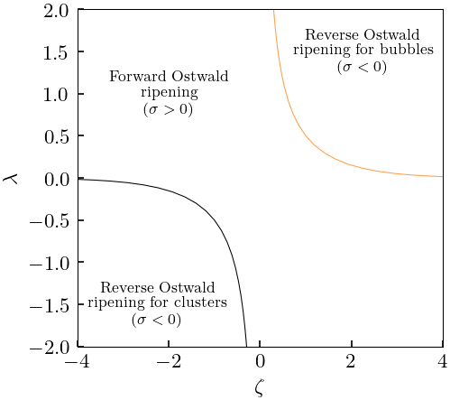
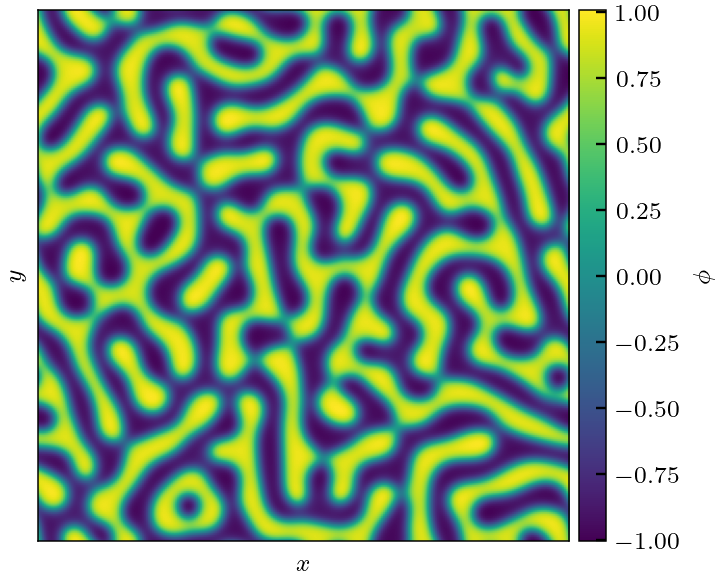
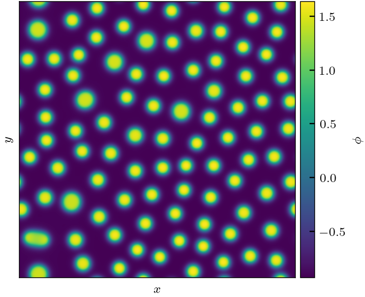

# active-model-bplus

## Overview

This package implements Active Model B+ which is the most general field theory proposed for scalar active matter to date. It has the following form for a scalar field $\phi$:
$$\partial_t \phi = \nabla^2{\left( \frac{\delta F}{\delta \phi} + \lambda |\nabla\phi|^2 \right)} - \zeta \nabla \cdot{\left( (\nabla^2 \phi) \nabla\phi \right)} - \sqrt{2 T} \nabla \cdot \vec\Lambda\,,$$
where $\vec\Lambda$ is a Gaussian white noise term with magnitude set by the temperature $T$ and
$$F[\phi] = \int \mathrm{d} V \left( f(\phi) + \frac{\kappa}{2} |\nabla\phi|^2 \right)$$
is the standard free energy functional sufficient to describe an equilibrium system undergoing liquid-gas phase separation (cf. the [Cahn-Hilliard equation](https://en.wikipedia.org/wiki/Cahn%E2%80%93Hilliard_equation)).
The bulk free energy is
$$f(\phi) = \frac{a}{2} \phi^2 + \frac{b}{3} \phi^3 + \frac{c}{4} \phi^4 + \mathcal{O}(\phi^5).$$
The coefficients $\lambda$ and $\zeta$ parameterise the activity in the system.

This package aims to provide tools to do mean-field calculations with this model, as well as to directly simulate it on a square grid with CUDA acceleration.

This is a work in progress that is being actively developed.


## Relevant literature and links

The main paper detailing the fascinating dynamics of Active Model B+ is

* [E. Tjhung et al., Phys. Rev. X 8, 031080 (2018)](https://journals.aps.org/prx/abstract/10.1103/PhysRevX.8.031080).

And the model was introduced by the same authors in their earlier paper:

* [C. Nardini et al., Phys. Rev. X 7, 021007 (2017)](https://doi.org/10.1103/PhysRevX.7.021007).

These authors have uploaded their numerical implementation as a [github repository](https://github.com/elsentjhung/active-model-B-plus) which is a another helpful resource.

To understand how Active Model B+ emerges from a minimal system, see [this preprint](https://arxiv.org/abs/2406.02409).


## Installation

To run the mean-field calculations only a python interpreter is required (as well as standard scientific packages installed with pip or otherwise).

Numerical simulations on a square grid are implemented in C++/CUDA and must be compiled.
The following libraries are prerequisite:
* CUDA for nvcc
* [pybind11](https://pybind11.readthedocs.io/en/stable/index.html) to create python bindings
* [Eigen](https://eigen.tuxfamily.org/index.php?title=Main_Page) - we use this C++ linear algebra library to convert between numpy arrays and internal data
* [catch2](https://github.com/catchorg/Catch2) to run the unit tests

Build the package via:
```bash
mkdir build
cd build
cmake ..
make
```
You are then ready to run simulations - see example at the bottom.


## Mean-field calculations

The mean-field calculations verify results of Tjhung et al. (2018), by calculating interface profiles and the surface tension $\sigma$.
These calculations are self-documented in the Jupyter notebook [examples/literature-compare.ipynb](examples/literature-compare.ipynb).

The main output of this notebook is the phase diagram, showing a region where droplets become size-stabilised forming lovely patterns:




## Numerical simulations

### Passive simulations

After building/installing the kernel code we need to import some relevant objects inside a python environment
```python
from activemodelbplus.integrator import Model, Stencil, Integrator
```
The classes `Model` and `Stencil` are data structures giving parameters for the simulation. `Model` contains those parameters in the Active Model B+ equation above, whereas `Stencil` contains properties of the discretisation onto the grid (and in time via the timestep). We assume a uniform square grid in 2d.

In our example we'll pick equilibrium parameters to recreate spinodal decomposition in an equilibrium system: 
```python
model = Model(a=-0.25, b=0, c=0.25, kappa=1, lamb=0, zeta=0)
```
The choice of $a=-c$ and $b=0$ sets the binodal to be at $\phi = \pm 

Now we set up the discretisation properties by setting
```python
stencil = Stencil(dt=1e-3, dx=1, dy=1)
```

We fix the initial condition in the unstable region and add some numerical noise so that it will undergo [spinodal decomposition](https://en.wikipedia.org/wiki/Spinodal_decomposition):
```python
phi0 = 0.  # average phi (will be conserved)
Ny, Nx = 256, 256
initial = 1e-1 * np.random.random((Ny, Nx))
initial += phi0 - np.average(initial)
```
The grid size should normally be a power of 2 for optimal performance with CUDA.
Note the order of indexing (y,x) so that the first index matches the `matplotlib` alignment.

We then create the simulation by constructing an `Integrator`:
```python
sim = Integrator(initial, stencil, model)
```
This object does all the heavy lifting of integrating the field theory in parallel via CUDA. We run the simulation via:
```python
tfinal = 1e3
sim.run_for_time(tfinal, show_progress=True, max_updates=10)
```
The python function `sim.run_for_time` adds some syntactic sugar to the underlying `sim.run(nsteps)` function (which takes the number of timesteps) so that you only have to specify an overall time (=`nsteps * dt`) and it will periodically show the % progress along with the current state of $\phi$ on screen (up to `max_updates` times).

It should produce something like the following output:



The full code for the example can be found in [examples/simulateSpinodal.py](examples/simulateSpinodal.py).

### Active simulations

The above example simulates Model B, i.e. without any non-integrable terms which are novel to
Active Model B+. It is straightforward to turn these on by passing non-zero values for `lambda`
and/or `zeta` when we construct the `Model` object. Simulating with $\lambda = -1$ and $\zeta = -4$
produces the following output:



The full code for this example can be found in [examples/simulateReverseOstwald.py](examples/simulateReverseOstwald.py).